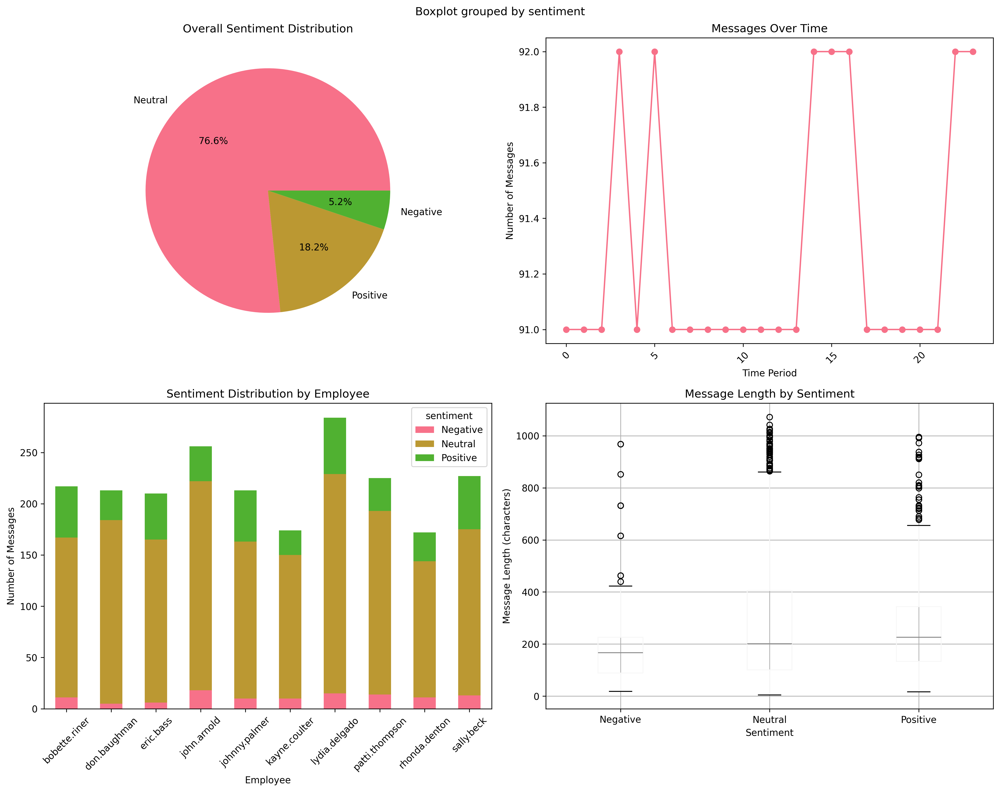
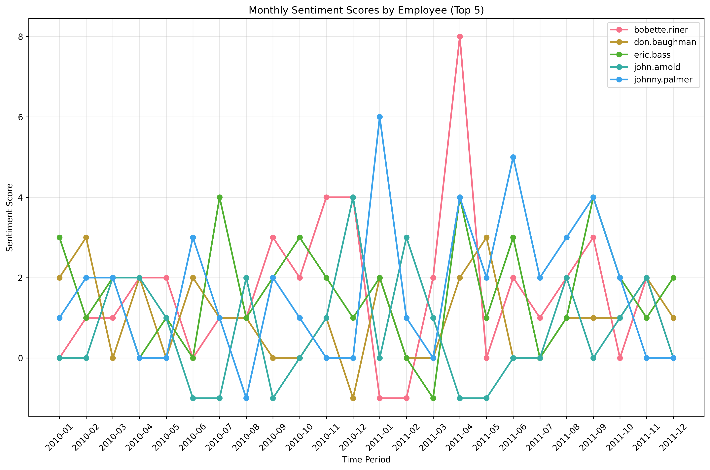
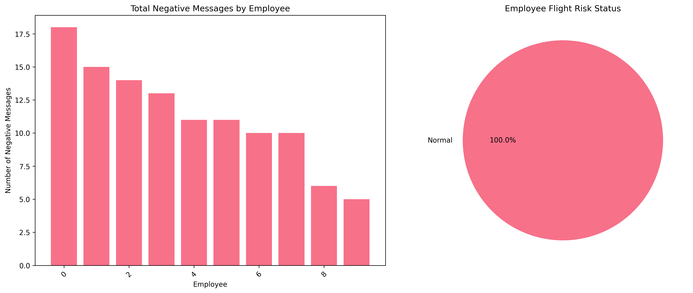
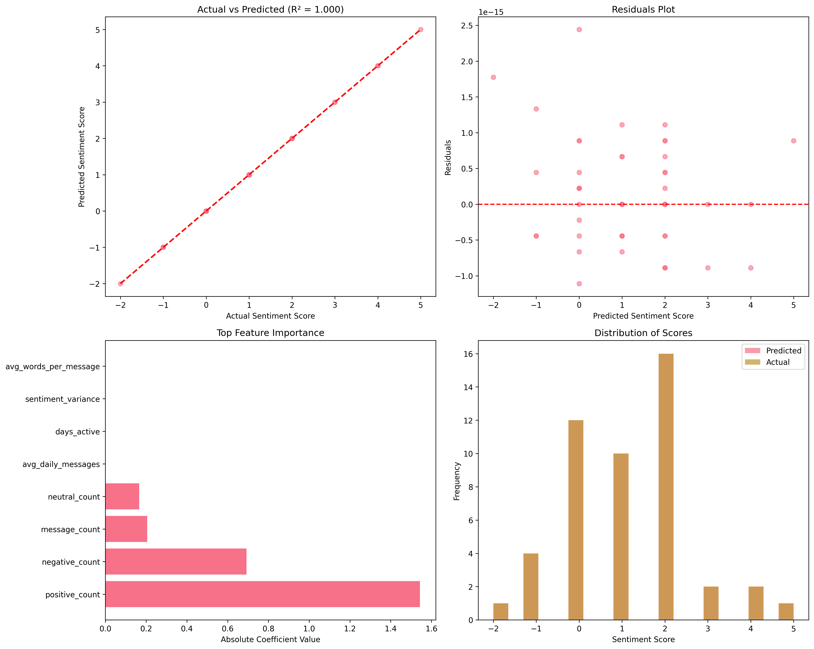

# Employee Sentiment Analysis

## Project Overview

This project analyzes a dataset of internal employee messages to assess sentiment, engagement, and potential flight risk. Using Natural Language Processing (NLP) with a Large Language Model (LLM), we labeled message sentiment, calculated monthly employee engagement scores, and built a predictive model to understand the key drivers of sentiment in the workplace.

## Repository Structure

```
.
├── Employee_Sentiment_Analysis.ipynb   # The main Jupyter Notebook with all code for data processing, analysis, and modeling.
├── Final_Report.docx                   # The detailed final report with in-depth analysis, findings, and conclusions.
├── README.md                           # This file, providing an overview and instructions for the project.
├── test.csv                            # The raw input dataset for the analysis.
├── labeled_dataset.csv                 # The output dataset generated by the script, with sentiment labels added.
└── visualization/                      # A directory containing all charts and graphs generated by the analysis.
    ├── eda_visualizations.png
    ├── flight_risk_analysis.png
    ├── monthly_scores.png
    └── predictive_model_performance.png
```

## Core Visualizations

Below are the key charts generated during the analysis:


*Figure 1(eda_visualizations.png): A summary of the Exploratory Data Analysis (EDA), showing the overall sentiment distribution, message volume over time, and distributions by employee and message length.*



*Figure 2: A time-series plot tracking the monthly sentiment scores for the top five most active employees.*



*Figure 3: An analysis of negative sentiment, showing the total negative messages per employee and the final overall flight risk status.*



*Figure 4: An evaluation of the linear regression model's performance, highlighting its predictive accuracy and key feature importance.*

## Methodology

The analysis followed these six core steps:

1.  **Sentiment Labeling:** A RoBERTa-based Large Language Model (LLM) was used to automatically classify each message as "Positive," "Negative," or "Neutral."
2.  **Exploratory Data Analysis (EDA):** The dataset's structure, sentiment distribution, and temporal trends were analyzed to uncover initial insights.
3.  **Employee Score Calculation:** A sentiment score was assigned to each message (+1, -1, 0) and aggregated monthly for each employee.
4.  **Employee Ranking:** Employees were ranked monthly based on their scores to identify top positive and negative performers.
5.  **Flight Risk Identification:** A 30-day rolling window was used to identify any employee sending 4 or more negative messages in that period.
6.  **Predictive Modeling:** A linear regression model was developed to quantify and predict the factors influencing employee sentiment scores.

## Setup

Follow these steps to set up the project environment.

1.  **Clone the Repository**

    ```bash
    git clone <your-repository-url>
    cd <repository-folder>
    ```

2.  **Create and Activate a Virtual Environment (Recommended)**

    ```bash
    python -m venv venv
    # Windows
    venv\Scripts\activate
    # macOS / Linux
    source venv/bin/activate
    ```

3.  **Install Dependencies**
    It is recommended to create a `requirements.txt` file with the following content:

    ```
    pandas
    numpy
    matplotlib
    seaborn
    scikit-learn
    torch
    transformers
    ```

    Then, install all required libraries with the following command:

    ```bash
    pip install -r requirements.txt
    ```

## Usage

1.  Ensure the `test.csv` data file is in the project's root directory.
2.  Run the main project file, **`Employee_Sentiment_Analysis.ipynb`**.
    ```bash
    # Launch Jupyter Notebook from your terminal
    jupyter notebook
    ```
3.  Open the `Employee_Sentiment_Analysis.ipynb` file in your browser and run all cells in order.
4.  The script will execute all analysis tasks, generating the `labeled_dataset.csv` file and all charts in the `visualization` folder.

## Summary of Findings

### Employee Rankings

Based on an analysis of monthly sentiment scores over a 24-month period, several employees consistently demonstrated either highly positive or negative communication patterns.

  * **Top Three Positive Employees (Most Frequently High-Ranked):**

    1.  `eric.bass`
    2.  `bobette.riner`
    3.  `johnny.palmer`

  * **Top Three Negative Employees (Most Frequently Low-Ranked):**

    1.  `rhonda.denton`
    2.  `kayne.coulter`
    3.  `patti.thompson`

### Flight Risk Assessment

A flight risk was defined as any employee sending **4 or more negative messages within a rolling 30-day period**.

  * **List of Employees Flagged as Flight Risks:**
      * **None.** No employees met the specific criteria to be flagged as an immediate flight risk.

### Key Insights

  * **Predominantly Neutral Environment:** The majority of workplace communication (76.6%) is neutral, which is standard for a professional setting. The analysis successfully filtered this noise to focus on meaningful positive (18.2%) and negative (5.2%) signals.
  * **Engagement is Measurable and Varies:** Consistent patterns of sentiment allowed for the clear identification of both positive influencers and employees who may be disengaged.
  * **Risk Exists Below the Threshold:** While no one met the strict flight-risk definition, the analysis revealed that several employees consistently registered low sentiment scores or had a high total volume of negative messages, indicating potential dissatisfaction.

### Recommendations

Based on the analysis, we propose the following actionable steps:

1.  **Proactive Engagement:** Schedule regular check-ins and offer support to employees who consistently exhibit negative sentiment patterns. Addressing concerns early can prevent escalation and improve retention.
2.  **Leverage Positive Champions:** Recognize and empower the most positive employees. They can act as mentors or cultural ambassadors to help foster a more engaging and supportive work environment.
3.  **Monitor Engagement Trends:** Use the sentiment scoring and ranking system as an ongoing tool to monitor team health and identify changes in employee engagement over time.
4.  **Refine Risk Alerts:** Consider creating a secondary "watch list" for employees who show a sudden increase in negative messages, even if they don't meet the formal flight-risk criteria, to enable earlier intervention.
